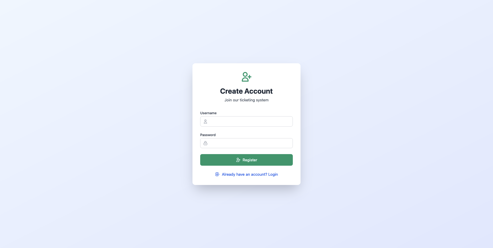
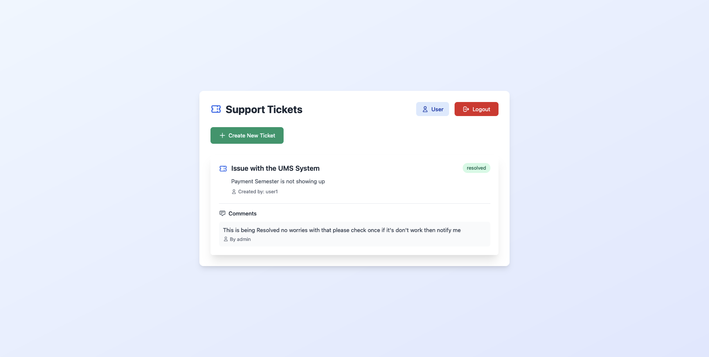
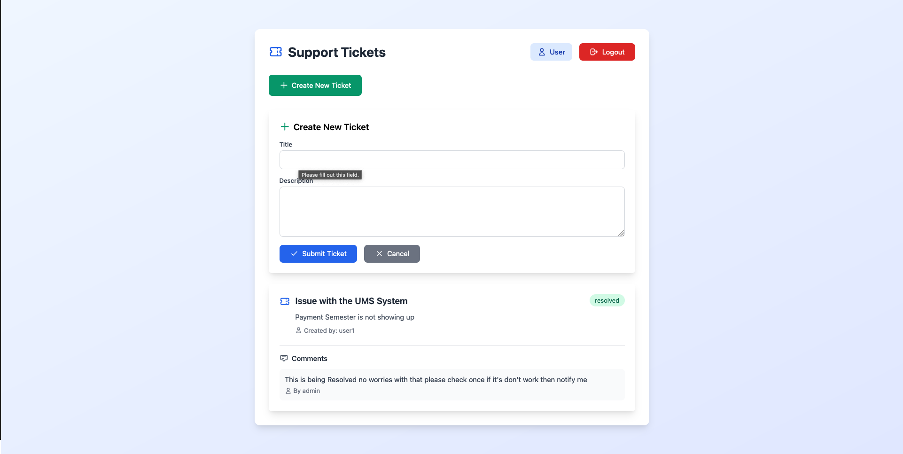
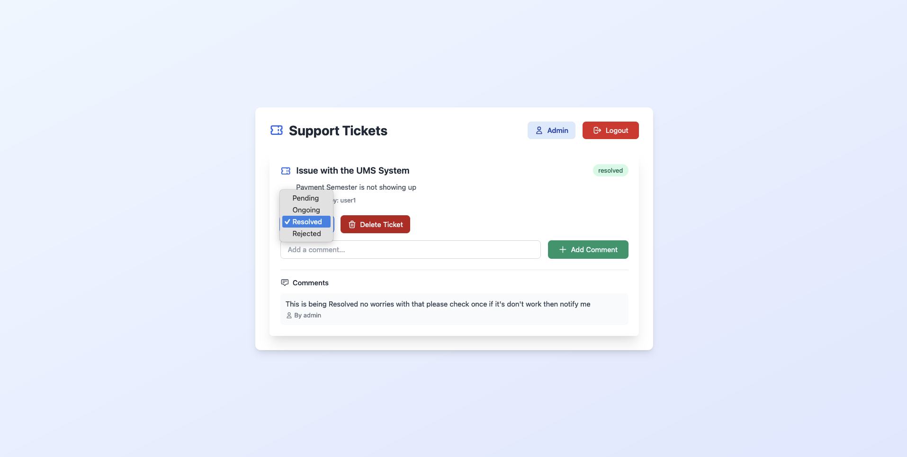

# Ticketing System

This project is a **Ticketing System** web application where users can create and update tickets, and admins can manage tickets by changing their statuses (Pending, Ongoing, Resolved, Rejected). The application uses **Node.js**, **Express**, and **MongoDB** with session management for authentication.

---

## Features

- **User Authentication**:
  - Users can sign up, log in, and manage their sessions.
  - Passwords are securely stored using hashing.

- **Ticket Management**:
  - Users can create and update tickets.
  - Admins can view, update, and change the status of tickets.

- **Role-Based Access Control**:
  - Regular users and admin accounts with specific privileges.

- **Session Management**:
  - Persistent sessions with cookies and secure storage.

---

## Tech Stack

- **Backend**: Node.js, Express.js
- **Database**: MongoDB
- **Session Management**: `express-session` with MongoDB store
- **Environment Variables**: `dotenv`

---

## Installation

1. Clone the repository:

   ```bash
   git clone <repository-url>
   cd ticketing-system

2. Install dependencies:
    ```bash
    npm install
    ```
3. Create a `.env` file in the root directory and add your environment variables:
    ```bash
    MONGODB_URI=<your-mongodb-connection-string>
    SESSION_SECRET=<your-session-secret>
    ```
4. Run the application:
    ```bash
    npm run dev
    ```
    The server will start on `http://localhost:3000`

## Directory Structure

```bash
ticketing-system/
│
├── routes/
│   ├── auth.js          # Authentication-related routes
│   ├── tickets.js       # Ticket-related routes
│
├── public/
│   └── index.html       # Frontend entry point
│
├── .env                 # Environment variables
├── app.js               # Main application entry point
├── package.json         # Project metadata and dependencies
```

## API Endpoints

### Authentication (`/api/auth`)

| Method | Endpoint  | Description                  |
|--------|-----------|------------------------------|
| POST   | `/signup` | Register a new user          |
| POST   | `/login`  | Log in with existing account |
| GET    | `/logout` | Log out the current session  |

---

### Tickets (`/api/tickets`)

| Method | Endpoint       | Description                                 |
|--------|----------------|---------------------------------------------|
| GET    | `/`            | List all tickets                           |
| POST   | `/create`      | Create a new ticket                        |
| PUT    | `/:id`         | Update an existing ticket                  |
| PUT    | `/:id/status`  | Update the status of a ticket (Admin only) |


## Security Notes

1. Password Storage:
    - Passwords are hashed before storing them in the database for security.
    - Use a library like bcrypt for hashing.
2. Session Security:
    - Sessions are stored securely in MongoDB with connect-mongo.
    - Cookies are httpOnly and secure in production.
3. Environment Variables:
    - Sensitive data like the database URI and session secret are stored in the .env file.

## Admin Account Setup

Upon starting the server, an admin account is automatically created if it doesn't already exist. The default credentials are:

- **Username**: `admin`
- **Password**: `admin123`

> **Note**: It is highly recommended to change the admin password after the first login for security purposes.

## Future Imporvements

- Add frontend views for a better user experience.
- Implement email notification for ticket updates.
- Add pagination and filtering ticket lists.
- Enhance Security with CSRF protection and HTTPS.

## License

This project is licensed under the MIT License - see the [LICENSE](LICENSE) file for details.

# Sample Images of the Software

### Login Page
</img>

### Create Account Page
</img>

### User Interface
</img>

### New Ticket
</img>

### Admin Interface
</img>
